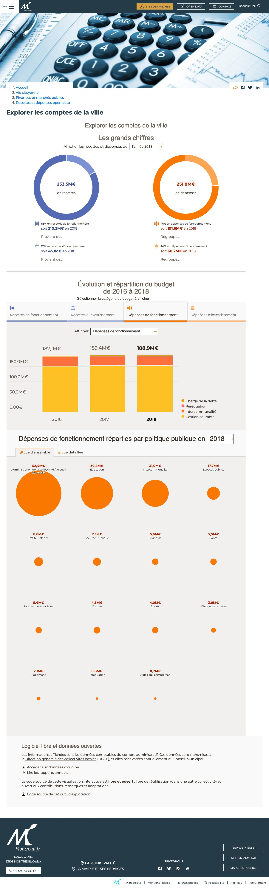

# Dataviz finances Montreuil [](https://travis-ci.com/dtc-innovation/dataviz-finances-montreuil)

## Contribuer

Au vu du scope du projet et de sa spécificité franco-française, il est décidé que le *readme*, les *issues*, *pull requests* et messages de *commit* sont à écrire **en français**.

Le code et les commentaires sont à écrire **en anglais**.

## Documents de travail

- 📋 [**Brief projet**](docs/Brief_UserResearch.md)
- ⏳ [Dépenses](docs/le-temps-qui-passe.csv) (temps passé par chacun·e d'entre nous)
- 📝 [Journal de bord](docs/Journal.md) (chacun·e le remplit à son rythme)
- 🗂 [Documentation](docs) (comptes rendus, entretiens, etc.)
- 🔤 [Glossaire](docs/Glossaire.md)
- 🔢 [**Plan d'itérations**](https://github.com/dtc-innovation/dataviz-finances-montreuil/projects) (vue priorisée)
- 🗄 [Actions à mener](https://github.com/dtc-innovation/dataviz-finances-montreuil/issues) (vue non-priorisée)
- 🎨 [**Maquettes**](https://www.figma.com/file/NKgSOd1pwalNQPx2LTTy5sTx/Dataviz-Montreuil) (navigation, userflow, analyse des contenus, écrans en cours, etc.)

## Présentation de l'outil

L’outil créé est une application 100% front-end chargée à partir de fichiers statiques HTML, CSS, JS, images, etc. Cette application utilise la bibliothèque React.js.

Le code source de référence est actuellement sur github à l’adresse suivante :
[github.com/dtc-innovation/dataviz-finances-montreuil](https://github.com/dtc-innovation/dataviz-finances-montreuil).

L'outil est composé comme suit :

- 📊 [**Visualisation grand public**][outil-exploration] : la visualisation telle qu'elle sera visible par le grand public ;
- 📋 [**Fonctions d'agrégation**][outil-agregations] : visualisation de l'état de partition des fonctions d'agrégation
- 🔢 [**Test des formules**][outil-formules] : formules d'agrégation interactives



## Intégration sur un site web

```html
<div class="finance-dataviz-container"></div>
<link rel="stylesheet" href="https://dtc-innovation.github.io/dataviz-finances-montreuil/build/public.css">
<script defer crossorigin="anonymous" src="https://polyfill.io/v3/polyfill.min.js?flags=gated&features=Map%2CSet%2CIntl%2CArray.prototype.flat%2CArray.prototype.flatMap%2Ces2017%2Ces2016%2Ces2015"></script>
<script defer src="https://dtc-innovation.github.io/dataviz-finances-montreuil/build/dataviz-finance-bundle.js"></script>
```

## Compatibilité navigateur

Minima:

* Edge
* [Firefox Extended Support Release](https://www.mozilla.org/en-US/firefox/enterprise/) (ESR)
* Chrome
* navigateurs mobiles


## Installer le projet

L'installation de [`node@>=12`][nodejs] est nécessaire avant de continuer.

Il faut (_forker_ et) _cloner_ ce dépôt pour procéder à l'installation des dépendances du projet :

```bash
npm install
```

### Faire fonctionner le projet sur son ordinateur

La commande suivante reconstruit les fichiers d'interface dès qu'un fichier source est modifié. Les composants web sont visualisables dans un navigateur web :

```bash
npm start
```

Deux adresses sont ensuite accessibles :

- [localhost:3000](http://localhost:3000/) : visualisation nature/fonction ;
- [localhost:3000/public/](http://localhost:3000/public/) : l'exploration éditorialisée, à destination du grand public.

### Anatomie des répertoires

- `./build` : fichiers de données et de l'application web
- `./data`
    - `./data/finances/CA` : [comptes administratifs anonymisés][anonymisation] ([format XML `DocumentBudgetaire`][DocumentBudgetaire])
    - `./data/finances/plansDeCompte` : [plans de compte](http://odm-budgetaire.org/composants/normes/2017/M14/M14_COM_SUP3500/) (format XML)
    - `./data/texts` : éditorialisation des fonctions et natures (format CSV)
- `./fonctions.html` : outil de visualisation des fonctions
- `./images` : ressources iconographiques
- `./index.html` : squelette de la visualisation nature/fonction
- `./public/index.html` : squelette de l'exploration éditorialisée
- `./src`
    - `./src/finance-overview` : composants pour la visualisation nature/fonction
    - `./src/public` : composants de l'exploration éditorialisée
    - `./src/shared` : composants partagés
- `./tests` : assurance qualité de calculs critiques
- `./tools` : outils en ligne de commande pour transformer des documents source en données optimisées

### Intégration continue

L'intégration continue est automatise les éléments suivants :

* exécution des tests sur _chaque branche_ ;
* déploiement de la [démo][] depuis _master_ ;

Le suivi des _builds_ est assuré par [Travis CI][].

#### Actionner le projet

En se rendant sur [Travis CI][] :

1. se connecter avec son compte GitHub (_Sign in with Github_) ;
2. se rendre sur son [profil Travis CI][] ;
3. cocher la case du projet `datalocale/dataviz-finances-gironde`.

Reste ensuite à [configurer l'outil](#configurer-travis-ci).


#### Générer un token GitHub

Un _Personal access token_ est nécessaire pour que l'automate d'intégration continue puisse publier la [démo][].

🔓 [Générer un nouveau _token_](https://github.com/settings/tokens/new?description=datalocale.github.io/dataviz-finances-gironde&scopes=public_repo)

Le token créé est à renseigner dans la [configuration Travis CI](#configurer-travis-ci).

#### Configurer TravisCI

Deux variables d'environnement doivent être configurées dans l'[onglet Settings][ci-settings] :

| Name | Value | Display value in build logs |
| ---- | ----- | --------------------------- |
| `GH_TOKEN` | _voir [Générer un token](#générer-un-token)_ | **Off** |


## Déploiement

**Remarque** : les étapes de la section `Installer le projet` doivent avoir été suivies au préalable.

Il existe 2 environnements :

* **démo autonome** : `npm run build` (construite par l'intégration continue)
* **développement** : `npm start`

| Variable d'environnement  | Valeur par défaut | Utilité
| ---                       | ---               | ---
| `BASE_URL`   | `https://dtc-innovation.github.io/dataviz-finances-montreuil`  | Explicite où sont hébergées les données et _assets_ de l'application.
| `NODE_ENV`   | `undefined`  | Optimise les artéfacts lorsque la valeur est `production`.

## Mise à jour des données financières

Les actions nécessaires à la mise à jour des contenus sont de plusieurs nature :

* mise à jour des labels finances
* mise à jour des données budgétaires
* mise à jour des règles d'agrégats

### Les labels finances

Actuellement les labels des articles de la norme comptable sont stockés dans un fichier csv.
Ce fichier est mis à disposition par la direction des finances au format Excel.

Ce fichier Excel se convertit en CSV à l'aide de [csvkit](https://csvkit.readthedocs.io/en/1.0.1/scripts/in2csv.html) :

```bash
in2csv --skip-lines 1 \
        --no-inference \
        --sheet "Table_Natures" \
        "data/NATURES - FONCTIONS v9.xlsx" > "data/agrégation-montreuil.csv"
```

### Les données budgétaires

Pour mettre à jour l'exercice budgétaire rendu visible dans la page d'accueil les étapes suivantes sont actuellement nécessaires


1. Mettre le fichier XML du nouveau CA dans [`data/finances/CA`][folder-CA]
1. Lancer la commande `npm run dl:plans-de-compte` pour ajouter automatiquement le bon plan de compte dans [`data/finances/planDeComptes`][folder-plan-de-compte] [^plan-de-compte].

### Les données d'agrégats

La dataviz finances est basé sur plusieurs éléments contribuant à son interopérabilité et à sa réutilisabilité :

* appui sur la norme comptable M14 et le [plan de compte](http://odm-budgetaire.org/composants/normes/) associé
* appui sur le schéma XSD ToTem
* déploiement continu d'une SPA (Single page application) qui peut être intégré à n'importe quel type de publication (site web autonome, page dans un gestionnaire de contenu)

En plus des présentations par fonctions ou nature M52, le Département de la Gironde présente ses comptes sous un format dit “agrégé”. Ils s’agit d’une centaine de catégories. Il existe (à une petite exception près) une association qui permet de passer d’un document budgétaire en M52 à un document agrégé.

Pour faciliter la gestion actuelle, un tableur numérique collaboratif permet l'écriture des formules en langage métier

https://docs.google.com/spreadsheets/d/1vb9YLAcjjkW1QA5bkuOpYOmD9y34YHwJAcgzepnLXxw/edit#gid=568066882

Cette association est encodée en JavaScript dans les deux fichier suivants :

https://github.com/datalocale/dataviz-finances-gironde/blob/master/src/shared/js/finance/m52ToAggregated.js
https://github.com/datalocale/dataviz-finances-gironde/blob/master/src/shared/js/finance/hierarchicalAggregated.js

Par ailleurs, il a été découvert début octobre 2017 que dans de rares cas, un montant associé à une même ligne M52 (fonction/article) se découpe dans 2 agrégats différents. Pour résoudre ce cas, un fichier de “correction” a été ajouté. Il peut être trouvé ici : https://github.com/datalocale/dataviz-finances-gironde/blob/master/data/finances/corrections-agregation.csv

Dans ce fichier CSV, chaque ligne correspond à l’assignation d’une ligne M52 à un agrégat pour un exercice donné


Pour réduire la charge de travail nécesaire, un prototype d'outil permettant de visualiser le résultat des formules a été développé

https://davidbruant.github.io/formule-doc-budg/

Avec quelques évolutions, il pourrait permettre d'enregistrer les formules saisies directement dans le code de l'application.

## Les données éditoriales

L’outil contient des pages dites “focus” qui permettent au Département de créer du contenu plus éditorialisé pour mettre en valeur ses actions et parler un peu moins de finance et un peu plus de l’action qui en découle.

## Licence

[MIT](LICENSE)

[nodejs]: https://nodejs.org/
[Travis CI]: https://travis-ci.com/dtc-innovation/dataviz-finances-montreuil
[profil Travis CI]: https://travis-ci.com/profile
[démo]: https://dtc-innovation.github.io/dataviz-finances-montreuil/public/
[ci-settings]: https://travis-ci.com/dtc-innovation/dataviz-finances-montreuil/settings
[DocumentBudgetaire]: https://github.com/DavidBruant/colors-of-the-finances/blob/master/docs/format-fichier.md
[anonymisation]: https://dtc-innovation.github.io/anonymisation-document-budgetaire/

[outil-exploration]: https://dtc-innovation.github.io/dataviz-finances-montreuil/public/
[outil-agregations]: https://dtc-innovation.github.io/dataviz-finances-montreuil/
[outil-formules]: https://dtc-innovation.github.io/dataviz-finances-montreuil/fonctions.html

[folder-CA]: https://github.com/dtc-innovation/dataviz-finances-montreuil/tree/master/data/finances/CA
[folder-plan-de-compte]: https://github.com/dtc-innovation/dataviz-finances-montreuil/tree/master/data/finances/plansDeCompte

[^plans-de-compte]: La référence officielle des plans de compte se trouve en ligne sur http://odm-budgetaire.org/composants/normes/.
