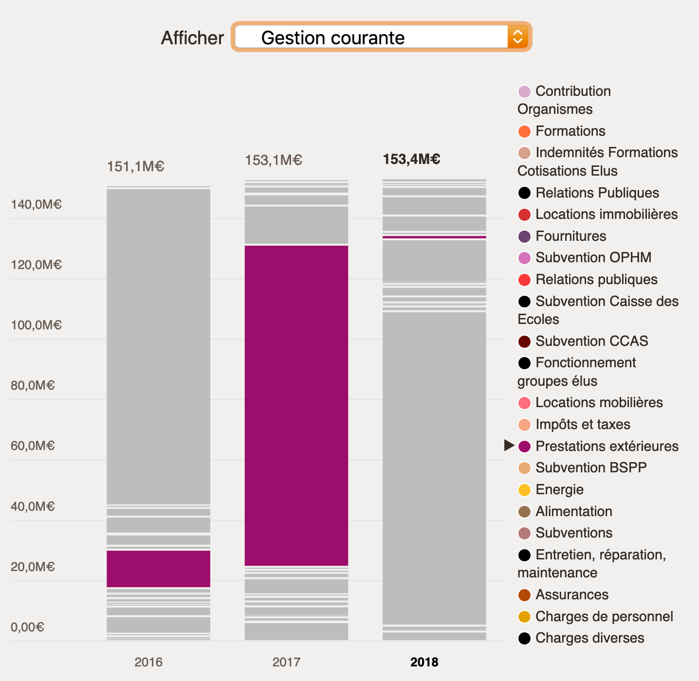
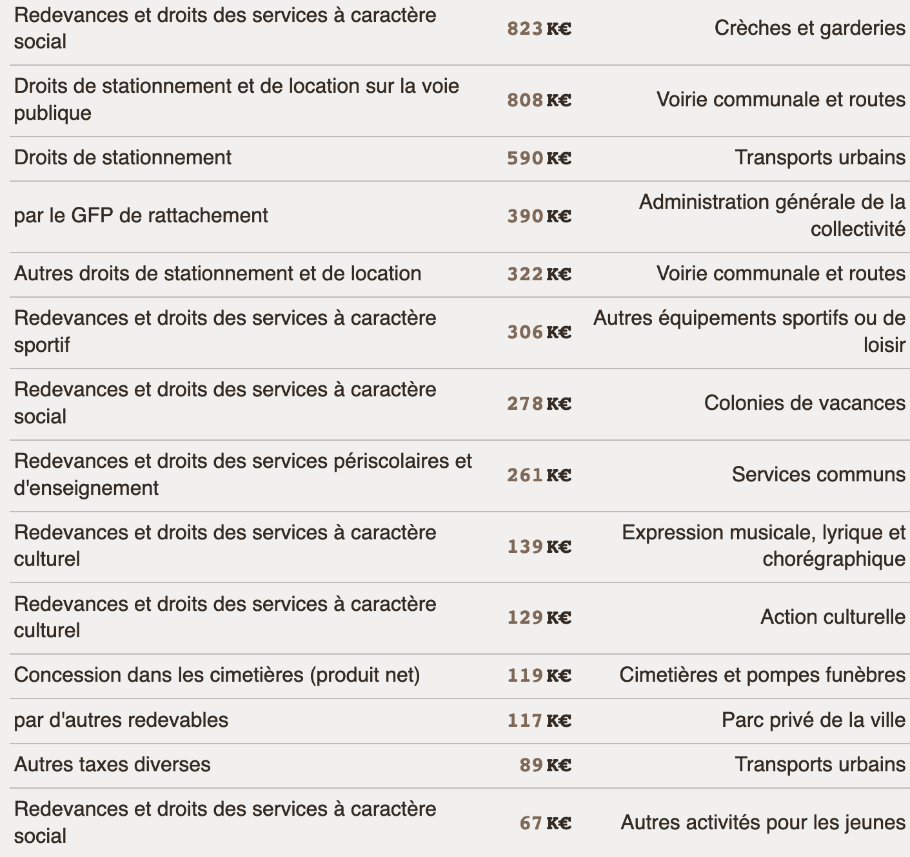

> Le sélecteur d'année… ok c'est pour voir la différence entre les montants.

🤔 Et la couleur des segments dans les camemberts ? Ah, c'est expliqué plus bas.

---

(_en regardant l'évolution du budget_)

😲 D'un coup, 100M€ comme ça ! Ils ont acheté des (…)

❓ C'est quoi "Péréquation" ?

---

(_en regardant la vue agrégée_)

❓ C'est quoi "Vue agrégée" ?

🤔 ça correspond à quoi les cercles ? Je le saurai peut-être en regardant "vue détaillée".

🗣 Je m'attends à une icône cliquable ⍰ pour accéder à une information que je ne connais pas.

---

(_la personne sélectionne les Dépenses d'Investissement puis les Dépenses d'Équipement_)

(_elle descend vers la Vue Détaillée_)

❓ Pourquoi je n'ai pas toutes les constructions ensemble ? (cf. le libellé de "Nature")

(_elle bascule vers la Vue Agrégée_)

🗣 Du coup si on cliquait sur "Éducation", on pourrait voir toutes les dépenses liées à l'Éducation.

👍 Ça a l'avantage d'être très précis.

❓ Mais on pourrait aussi avoir une vue agrégée globale ?

❓ On regarde les chiffres de quelle année ?

(_la personne remonte vers l'Évolution du Budget_)

(_la personne clique sur l'année 2016 en pied de graphique, puis 2018_)

🤔 Ah, les briques changent de couleur quand on change d'année (les libellés sont identiques pourtant).

❓ Comment je fais pour voir les Dépenses d'Investissement de "Terrains" dans la Vue Détaillée ?

🤔 Ça m'embrouille de passer de `M€` (Évolution & cie) à des `K€` (Vue Détaillée), surtout quand `9000K€` équivalent à `9M€` — j'ai du mal à comprendre ce que je regarde.

---

(_la personne remonte vers l'Évolution du Budget_)

👍 Les impôts, tiens c'est intéressant !

👍 Là je comprends mieux, il y a moins de choses (briques/éléments de légende).

👍 Le graphique est bien.

🤔 Je sais que c'est légal, mais ça manque de lisibilité. J'aimerais savoir ce que dépenses la ville pour la Culture. Là, c'est une approche comptable.

👍 Ce que je sais, c'est qu'on paie plus pour la Sécurité que pour la Culture.

(_la personne descend vers la Vue Agrégée_)

😮 ah, je n'avais pas vu qu'on pouvait survoler les cercles de couleur ! Je me demandais ce que c'étaient ces formes… je voyais les grandes catégories mais pas ces petites choses.

🤔 À chaque section de la page il y a un outil différent. En plus comme ce sont de petits points, je les vois difficilement.

🤔 C'est bizarre le nommage de "Administration de la collectivité / Accueil du public". Ça correspond à ce que les habitant·es paient, non ?

👎 De manière générale, on ne voit pas que ce sont les habitant·es qui paient.

❓ Tiens, l'Éducation rapporte des sous ? (cf. Recettes de Fonctionnement > Produits des Services). J'aimerais pouvoir voir ses recettes et produits.

❓ Je me demande pourquoi les Théâtres ne rapportent rien (Cf. Culture)

(_la personne navigue vers la Vue Détaillée_)

🗣 J'aurais bien cliqué sur "Colonies de vacances" pour voir les autres recettes associées aux colonies.

🤔 Le passage entre vue agrégée et vue détaillée n'est pas évident.

👍 J'aime bien les pictos.

# Clôture

🗣 "Vue agrégée" ça ne me parle pas trop. "Vue d'ensemble" oui, surtout en regard avec "Vue détaillée".
