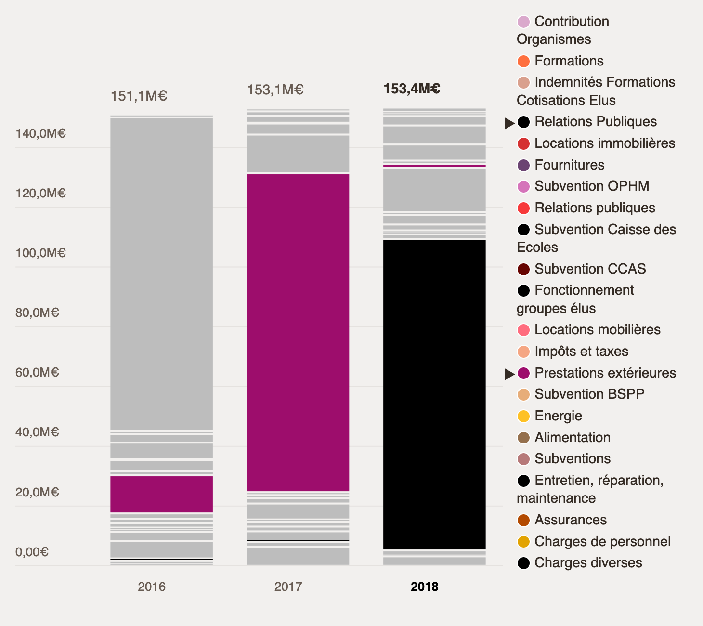

**Remarque** : cette personne n'habite pas à Montreuil mais y vient régulièrement, notamment pour le cinéma car les places sont à 4€.

**Remarque** : la personne y voit mal sans ses lunettes, j'effectue les manipulations à sa demande, en appliquant un zoom navigateur de 170%.

---

❓ Combien il y a d'habitant·es à Montreuil ?

❓ Et il y a combien de fonctionnaires ?

🤔 Qu'est-ce qui est fait des 2M€ d'excédents, ils les placent ?

❓ `M€` c'est millions ou milliards ?

(_la personne me fait scroller vers le bas de la page_)

🤔 Je ne comprends pas tous les ronds — les montants des politiques publiques c'est OK par contre.

❓ Les 4.5M€ de la culture, ça fait combien en % ?

❓ Idem pour le Sport… c'était combien le budget total déjà ?

(_la personne me fait scroller vers l'Évolution du Budget, je lui montre la Gestion Courante des Dépenses de Fonctionnement_)

❓ Quel est le % annuel de la brique survolée ?

🤔 Je ne comprends pas, les Prestations extérieures sont devenues des Relations Publiques ?

❓ Quelle est la rémunation des personnes qui siègent au Conseil Municipal ?

# Clôture

👍 C'est bien cette démarche. J'aimerais voir la même chose pour Paris.
