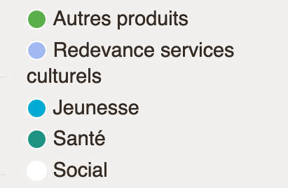
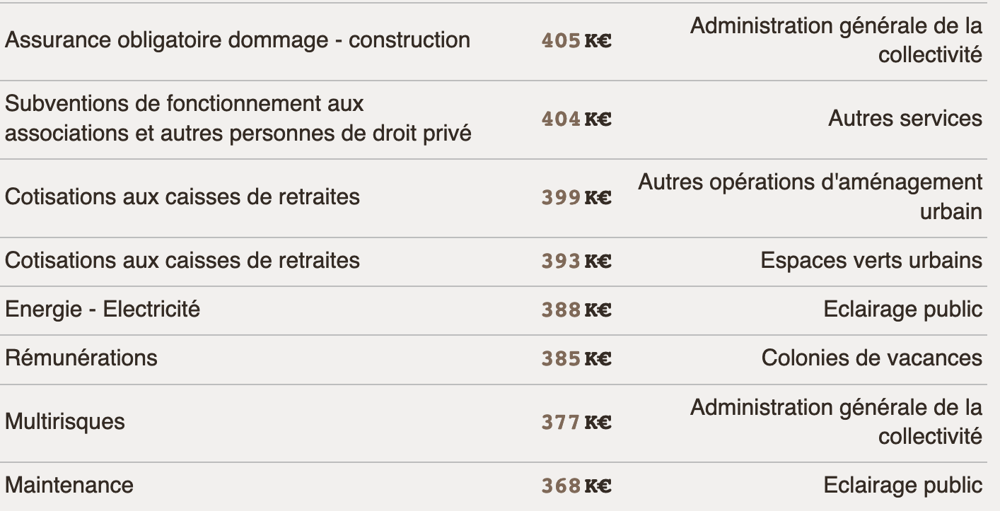

❓ Comment je fais pour savoir quels sont les éléments interactifs de la page ?

🤔 Les Recettes d'Investissement sont de 40M€ ; les Dépenses d'Investissement sont de 60M€, c'est un déficit sur investissement, c'est grave ?

❓ Ça veut dire quoi "Péréquation horizontale" ?

(_la personne descend vers l'Évolution du Budget_)

🤔 C'est gênant l'item de légende multilignes.

(_la personne choisit les Recettes de Fonctionnement puis Dotations et Subventions_)

😖 Je sélectionne les "Subventions européennes" mais elles ne s'affichent pas. Du coup je **perds confiance**.

👍 Quand ça marche, c'est hyper clair sinon.

😖 Idem pour les "Cessions d'immobilisation"

(_la personne choisit les Dépenses de Fonctionnement puis Gestion courante_)

🤔 Les changements d'une année sur l'autre sont énormes !

🗣 On pourrait agrandir la hauteur du graphique pour éviter que tout soit écrasé ? La liste est longue…

(_la personne descend vers la Vue Détaillée_)

🤔 C'est quoi le rapport entre "Cotisations retraites" et "Espaces verts" ?

👎 J'ai du mal à distinguer chaque ligne sans séparateur (**Remarque** : ça a été corrigé, la capture d'écran ne reflète pas ce ressenti).

👍 J'adore, lire 15€ de dépenses de timbres dans le détail.

🗣 J'ai envie de lire toutes les lignes des "Espaces vers urbains".

🤔 Ça sert à quoi l'identifiant `N...F...` ?

❓ C'est quoi "Rémunération principale" ?

# Clôture

👍 J'ai appris que les investissements ne sont pas rentables.

🗣 J'ai besoin de texte pour comprendre les chiffres que je vois.

👍 Les graphiques sont clairs à lire.

👍 La Vue Détaillées : c'est super de voir tous les chiffres… mais c'est dur au bout d'un moment.

🗣 Voir les 5 plus grandes et 5 plus petites dépenses dans la Vue détaillée donnerait un aperçu de l'écart entre montants.

👍 C'est utile pour voir la nature des recettes et des dépenses pour comprendre vers quels budgets atypiques aller lorsqu'on veut proposer un projet à la ville (notamment par rapport aux jardins et espaces d'agriculture).
