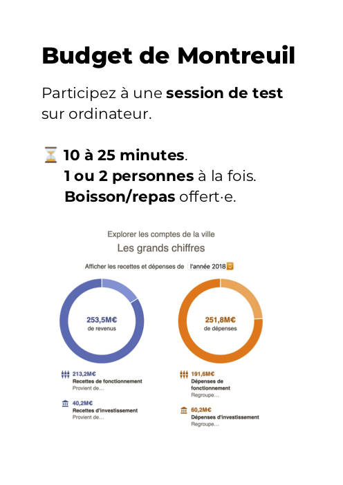

# Entretiens utilisateurs

Chaque fichier `.md` correspond à un entretien mené avec le consentement d'une personne sur le territoire de Montreuil.

L'intention est de s'adresser à des Montreuillois·es : l'outil les concerne et l'engagement à tester l'interface n'en serait que plus manifeste.

## Procédure de recrutement

Plusieurs approches ont été testées :

- présence d'une signalétique dans un lieu privé (type café) pour signifier la présence d'une table où se déroulerait le test — cet "événement" est relayé sur les réseaux sociaux du lieu hôte ;
- aborder une personne dans un lieu privé (type café) avec un imprimé A3 de la visualisation, en leur demandant s'ils ont 15-20 minutes pour discuter des recettes et dépenses de la ville de Montreuil.

Étaient mentionnées les informations suivantes :

- la procédure est entièrement anonyme ;
- je suis un développeur qui travaille pour la Mairie de Montreuil (en prestation), et plus particulièrement avec la Direction des Finances ;
- c'est pour tester une page interactive qui sera mise en ligne sur le site de Montreuil dans les semaines à venir ;
- je suis ravi de dédommager la personne pour son temps et effort en couvrant les frais de son repas, d'une boisson ou d'une collation de son choix.

## Procédure d'entretien

1. L'écran d'ordinateur est ouvert (eeePC ou macBook selon le niveau de batterie) avec une souris optique (achetée à 5€ d'occasion) ;
2. Je demande depuis combien d'années la personne habite à Montreuil ;
3. La visualisation est affichée dans son état par défaut ;
4. J'indique que la personne est libre de découvrir et parcourir l'interface comme ça lui plait ;
5. Je précise que je poserai quelques questions à la fin de la découverte, et qu'entre temps, j'observerai son utilisation pour comprendre comment elle l'utilise, et pour ceci, je prendrai des notes au stylo dans mon carnet ;
6. Les personnes en viennent rapidement à dire à voix haute ce qui les travaille, ce qui les interroge — par rapport à l'interface, ce qu'elles s'attendaient à y trouver ou en lien avec d'autres événements extérieurs dont elles ont connaissance (actualité signalant un déficit, le caractère obligatoire des abonnements de stationnement, l'abattage d'arbres sur une place publique) ;
7. J'interviens quand :
    1. Je sens que la personne bloque et a épuisé toutes ses options ("Est-ce que tu cherches à faire/trouver quelque chose en particulier ?", "Si je te dis que tu peux cliquer là, il se passe quoi ?", "Et si tu cliques à cet endroit, est-ce que ça répond à ta question ?")
    2. La personne parle d'un sujet qui est présent dans l'interface mais n'a pas encore découvert le chemin pour y accéder (évaluer la dette, se rendre à la section suivante)
8. Je clôture la session en demandant :
    1. Ce que la personne a appris ;
    2. Ce que la personne a trouvé utile.

La procédure révèle les freins et incompréhensions, je ne ressents pas le besoin d'effectuer une redite en conclusion.
